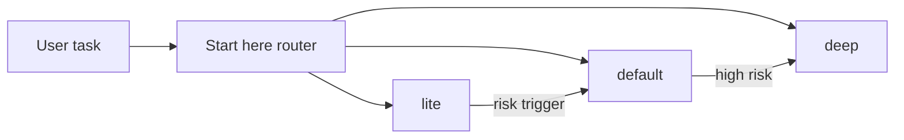

# PRD: Issue #10 Workflow Modes, Token Budgets, Progressive Disclosure

## Decision Need

- decision: Define lightweight workflow modes so Autopraxis can reduce default token/context cost without losing deep rigor for risky work.
- owner: Autopraxis maintainer.
- linked issue: https://github.com/Zhachory1/autopraxis/issues/10
- base branch: `feat/issue-11-council-minimization`
- next gate: DD and council review.

## Problem

Autopraxis workflows intentionally use docs, councils, handoffs, approvals, references, and telemetry. That is valuable for high-stakes work but too costly and confusing for common low-risk tasks. The README router has advisory depth labels, but skills do not yet define what they mean.

## Goals

- Define `lite`, `default`, and `deep` behavior for every top-level workflow.
- Add risk triggers that escalate depth.
- Add progressive disclosure guidance: load only the selected workflow and needed references.
- Add structured non-token budget fields to telemetry guidance.
- Update README mode wording so issue #10 is no longer described as future work.
- Add validation that workflow modes remain present.

## Non-Goals

- Enforce exact token counts in runtime.
- Build eval harness or prove 20% reduction; issue #9 owns evals.
- Add CLI mode flags.
- Rewrite all skills into compact cards.
- Prove a measured 20% token reduction before eval harness exists.

## Primary Metric

- every top-level workflow declares usable `lite/default/deep` modes, risk triggers, and progressive-disclosure rules.

## Guardrails

- do not remove high-risk gates from `deep`.
- `lite` must escalate when risk/ambiguity appears.
- mode text must be compact and avoid repeated tables.
- telemetry must record selected mode and escalation reason without raw artifacts.

## Mode Model

What to notice: modes are a progressive-disclosure contract, not separate workflows.

## Acceptance Criteria

- every top-level workflow has `## Workflow Modes`.
- each mode table includes `lite`, `default`, `deep`.
- workflows document escalation triggers.
- workflows document progressive disclosure/reference loading.
- `run-telemetry` documents `workflow_mode`, structured `mode_budget`, and `mode_escalation_reason` fields.
- README no longer says issue #10 will define modes later.
- `npm test` validates mode sections and telemetry fields.
