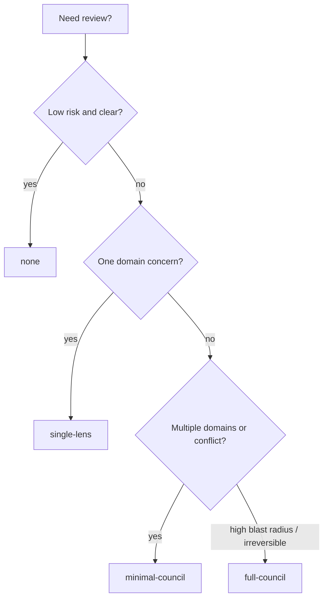

# DD: Issue #11 Council Escalation And Minimization

## Decision Need

- decision: Implement issue #11 as a shared reference plus workflow guidance and validation.
- owner: Autopraxis maintainer.
- PRD: `docs/issues/11-council-minimization/PRD.md`
- next gate: council review.

## Context

`council-review` is a shared primitive used by development, ML, ideation, roadmapping, and backprop workflows. Current prose says councils are bounded, but not when to skip or downshift them.

This PR should make the policy visible without changing runtime behavior or agent-fleet internals.

## Goals

- Add `skills/council-review/references/escalation-matrix.md`.
- Add council-level selection guidance to `council-review` execution and output.
- Update council-calling workflows with a short `Council Policy` section.
- Extend validation so the matrix cannot disappear.

## Non-Goals

- no new skill.
- no CLI changes.
- no persona roster rewrites.
- no eval harness.
- no actual token counting.

## Proposed Design

### Escalation matrix reference

Add a reference file with:

- levels: `none`, `single-lens`, `minimal-council`, `full-council`.
- triggers and examples.
- default rules.
- output/telemetry fields.
- anti-patterns.

### Council-review skill changes

Update `council-review/SKILL.md`:

- load/reference matrix before selecting personas.
- choose level before convening.
- skip or single-lens when low/medium risk.
- define `none` and `single-lens` output shapes.
- run agent-fleet council only for minimal/full council.
- include exact level/reason fields in output and telemetry.

### Workflow changes

Add a compact `Council Policy` section to:

- `dev-workflow`
- `ml-experiments`
- `project-ideation`
- `roadmapping`
- `backprop`
- `debug-investigation`
- `pr-review` because it can escalate to council for high-risk/conflicting review calls.

## Council Level Visual

What to notice: most routine work should stop before multi-persona council.

## Alternatives Considered

| Option | Pros | Cons | Decision |
|---|---|---|---|
| policy in `council-review` only | small | workflows still ambiguous | rejected |
| policy repeated in every workflow | visible | duplicate drift | rejected |
| shared reference + workflow pointers | visible and maintainable | one extra reference file | selected |
| modify agent-fleet council | stronger enforcement | outside repo scope | rejected |

## Test Plan

- `npm test`
- `npm pack --dry-run`
- validation checks matrix and workflow references.

## Rollout

Skill guidance only. Existing workflows remain compatible. This PR defines the council-selection contract and output fields; executable telemetry commands and eval enforcement remain #12 and #9.
