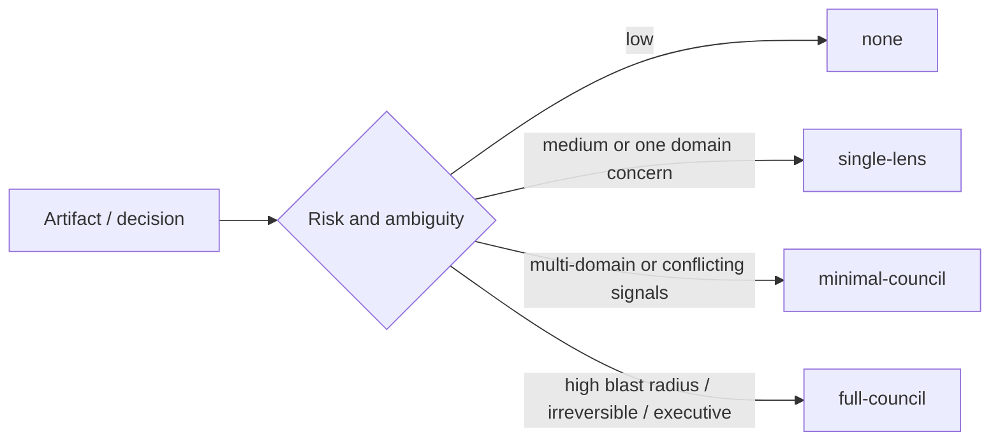

# PRD: Issue #11 Council Escalation And Minimization

## Decision Need

- decision: Make council usage risk-based so workflows avoid expensive multi-persona review unless it is justified.
- owner: Autopraxis maintainer.
- linked issue: https://github.com/Zhachory1/autopraxis/issues/11
- base branch: `feat/issue-8-workflow-router`
- next gate: DD and council review.

## Problem

Councils are high-value for ambiguous or high-risk work, but they are also one of the largest token, latency, and confusion multipliers in Autopraxis. Several workflows can invoke `council-review` without a shared escalation policy.

## Why This Matters

- developer impact: low-risk work should not pay full council cost.
- PM/leadership impact: high-stakes decisions still need clear escalation.
- maintainer impact: future workflow modes and evals need a shared council-level field.
- token/cost impact: full council should be opt-in by risk, not the default shape.

## Goals

- Document a shared council escalation matrix.
- Add council levels: `none`, `single-lens`, `minimal-council`, `full-council`.
- Define risk triggers for each level.
- Update `council-review` to pick/record a council level.
- Update workflows that invoke council to reference the matrix.
- Define exact output and telemetry fields for selected council level and reason.

## Non-Goals

- Modify agent-fleet `/council` behavior.
- Implement eval penalties for unnecessary councils; issue #9 owns eval harness.
- Implement full lite/default/deep mode budgets; issue #10 owns modes.
- Add runtime cost estimation beyond council-specific count/budget fields.

## Primary Metric

- Every workflow that invokes `council-review` documents when to skip, minimize, or escalate council.

## Guardrails

- full council remains available for high-risk decisions.
- low-risk docs/code paths can skip council or use one lens.
- no workflow should require full council by default without a risk trigger.
- telemetry must record the selection reason without storing sensitive content.
- `none` and `single-lens` behavior must be explicit, not implied.

## Council Levels

| Level | Behavior | Cost cap |
|---|---|---|
| `none` | emit skipped gate with reason; no reviewer/persona | 0 personas |
| `single-lens` | run one relevant lens/reviewer with normal verdict shape | 1 persona, no reflection |
| `minimal-council` | run small multi-persona review | 2-3 personas, max 1 reflection |
| `full-council` | run broad high-stakes review | 4-6 personas, explicit high-risk trigger |

Telemetry should use `metrics.council_level`, `metrics.council_reason`, `metrics.persona_count`, and `metrics.agent_fleet_invoked`.

What to notice: council size scales with decision risk, not with workflow complexity.

## Acceptance Criteria

- `council-review` has or links to the matrix.
- workflows using council reference skip/minimal/full triggers, including `debug-investigation`.
- dev workflow says final council is not needed unless risk, conflict, unresolved blocker, or design mismatch appears.
- telemetry/output contract includes council level and reason.
- `npm test` validates matrix and workflow references.

## Open Questions

- Should `single-lens` be a council? Answer: no; it is a cheaper review path using one relevant reviewer/persona.
- Should matrix enforce exact persona rosters? Answer: no; keep roster selection in `council-review` / agent-fleet.
