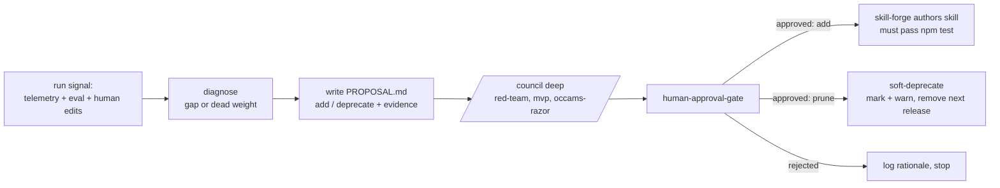

# DD: Issue #13 Skill Lifecycle (self-authoring / self-pruning workflows)

- status: revised-per-council
- owner: Autopraxis maintainer
- next gate: agent-fleet /council (deep) → human-approval-gate
- related: `backprop`, `run-telemetry`, `docs/roadmap/self-improving-skills-roadmap.md`, `docs/reference/workflow-expansion.md`, `docs/reference/evaluation-framework.md`, global `skill-forge`/`agent-forge`

## Council Outcome (2 BLOCK / 3 SHIP-WITH-CHANGES → REVISE)

A deep council (red-team, mvp, occams-razor, software-architect, data-engineer) reviewed the original shape and unanimously said: do not build a peer meta-workflow now. Binding revisions, sequenced in `docs/roadmap/self-improving-skills-roadmap.md`:

- **Signal semantics fixed (M1):** `run_disposition` is a downstream fact — it moves to a **late event keyed by `run_id`**, never the run's own `end`. `skills_invoked`/`agents_invoked` are **loader-emitted**, not agent-reported (absence must mean "not loaded," not "agent forgot"). `unmet_need` is a **concrete router state** (default/unmatched), not "user improvised." A defined **aggregate store** replaces reliance on siloed per-checkout `.workflow-runs/`.
- **ADD folds into `backprop` (M3):** the diagnose→propose→council→human→author flow already exists in `backprop` + `skill-forge`; add a "missing/dead-skill" hypothesis type instead of a duplicate meta-workflow.
- **PRUNE is last and add-only until then (M4):** soft-deprecate only, split by ownership seam — repo-owned in-repo; vendored/persona agents via upstream PR only (local marks get clobbered by `bin/sync-agent-fleet.mjs`). Absence-based prune excludes safety/incident/security/rare skills and gates on per-skill invocation counts, not a global run window.
- **≥5-run floor becomes a runtime refusal**, not a dev-time wait: the code ships now and refuses to author/prune until 5 real runs exist in the aggregate store.
- **Standalone `skill-lifecycle` skill is optional (M5):** build only if backprop modes prove insufficient.

## Decision Need

- decision: Should Autopraxis gain an automated loop that learns from prior runs and **creates or retires workflow skills** — and if so, how much autonomy does it get?
- ask of reviewers: approve the **propose-only, human-gated** shape below, or reject/rescope.

## Context

Autopraxis's thesis is self-improvement, but skill inventory is curated by hand today. `docs/reference/workflow-expansion.md` is a manually authored, manually ranked candidate list (release-readiness, incident, security, ...). The request: automate producing that artifact, and let a scheduled or manual loop add skills it thinks are missing and prune ones it thinks are unused.

Cave man note: repo already has learning loop (`backprop`) and skill authoring (`skill-forge`). Missing piece is signal to learn from, plus a governed lifecycle that turns signal into skill add/retire proposals.

## Scope

- in scope: a **manually kicked-off** `skill-lifecycle` meta-workflow that ingests run signal, diagnoses missing/dead skills, and emits **proposals** (add / deprecate) gated by council + human.
- prune target: **any skill, workflow, or agent** — top-level workflows, shared primitives, and vendored/persona agents are all in scope for deprecation proposals.
- out of scope (this DD): any autonomous mutation of the package — no auto-create, no auto-delete, no auto-commit, no auto-publish. **Cron/scheduling is out of scope entirely** for now; kickoff is manual only.

## Blocking Precondition: No Signal Yet

`.workflow-runs/<run-id>/` is local and gitignored; the eval framework is `metric_status: contract_only` (model-free). **There is no accumulated run history to learn from.** A lifecycle loop run today would invent gaps from nothing and author noise — the exact bloat `mvp`/`occams-razor` councils exist to kill.

Therefore ordering is a hard gate:

1. **Signal first.** Extend `run-telemetry` with the three `metrics` fields below. Until this exists and **at least 5 runs** of signal have accumulated, `skill-lifecycle` must refuse to author/prune and only report "insufficient signal."
2. Then manual propose-only lifecycle (this DD).

The signal threshold is a hard floor: `skill-lifecycle` reads the trailing telemetry window and, if fewer than 5 runs are present, stops with "insufficient signal (<5 runs)" and emits no proposal.

### Required `run-telemetry` signal (schema v1, under `metrics`)

All three ride under the existing `metrics` object — no new top-level fields, so `schema_version` stays 1 (the skill's own stable-schema rule):

| Field | Event | Source | Purpose | Drives |
|---|---|---|---|---|
| `skills_invoked` / `agents_invoked` (arrays) | `end` | loader (automatic) | which skills/agents actually loaded | prune: dead = absent across the window |
| `run_disposition` (`accepted\|edited\|rejected`) | **late `human_response`, keyed by `run_id`** | human/audit, backfilled | did the run's output survive | prune quality: used-but-always-rejected is also dead weight |
| `unmet_need` (bool) + `unmet_need_note` (short, non-sensitive) | `escalation` | router state (default/unmatched route id) | a workflow was missing | add: positive signal for a missing workflow |

Notes from council: disposition is a downstream fact and MUST NOT ride the run's own `end` (a run can't grade its own survival); it backfills via a late event with a "pending" watermark. `skills_invoked` is emitted by the loader, not agent memory. `unmet_need` is the only genuinely new capability. No sentiment scores, no free-form logging; the privacy validator still rejects raw content, and `unmet_need_note` stays in the non-content allowlist.

## Proposed Design

A meta-workflow that runs autonomously **up to the point of proposing** and hard-stops at every state-changing action.

- **Input:** `run-telemetry` history + eval results + failure/rework/human-edit signal.
- **Diagnose:** recurring unmet need (candidate new workflow) OR low-value skill (never invoked / low accepted-outcome rate). Reuses `backprop` diagnosis rather than re-inventing it.
- **Propose, never act:** emit `PROPOSAL.md` (add skill X / deprecate skill Y) with evidence pointers. This is the automated successor to hand-written `workflow-expansion.md`.
- **Gate:** `/council` deep (standing bloat controls `red-team`/`mvp`/`occams-razor` + task lenses) then `human-approval-gate`.
- **Author (add):** only after approval, via `skill-forge`; the new skill must carry the repo contract (frontmatter, README router row, eval fixture, telemetry, `## Self-Improvement`, Loop Controls) and pass `npm test`.
- **Prune:** **soft-deprecate only**, covering **any skill, workflow, or agent** — mark deprecated, warn on use, remove one release later. Never hard-delete on a whim.
- **Kickoff:** **manual only.** No cron/scheduler in scope. A maintainer runs the workflow when they want a lifecycle pass.

## Guardrails (non-negotiable)

- **No auto-prune of published skills.** Deleting capability from a published npm package others installed is a destructive one-way door. Human-approved soft-deprecation is the ceiling.
- **No scheduler that commits or publishes.** Autonomous writes to a supply-chain artifact are a trust/security boundary. Kickoff is manual; if scheduling is ever revisited it may only open a proposal/PR and stop (a nag, not an actor).
- **No skill bypasses review/eval/telemetry contracts.** Self-authored skills go through the same `npm test` gates as hand-authored ones.
- **Refuse on insufficient signal.** No authoring decisions from empty/thin telemetry.

Evidence these matter: this session alone hit a red `main` (incomplete rename), a lost release-bump commit, and a wrong-account push — all with a human in the loop. Remove the human and schedule it against a published package and those become unattended supply-chain failures.

## Alternatives Considered

| Option | Why rejected |
|---|---|
| Full autonomy: cron creates AND prunes skills it "doesn't need" (original ask) | Destructive, points unattended codegen at a published package, no signal to justify. Blocked as specified. |
| Fold entirely into `backprop`, no new skill | Backprop optimizes existing workflows; lifecycle add/retire of skills is a distinct governance surface. Reuse backprop diagnosis, but keep the gated add/retire flow separate. |
| Do nothing; keep `workflow-expansion.md` manual | Viable near-term, but doesn't scale and ignores the self-improvement thesis. Propose-only automation is the measured middle. |

## Test Plan

- `npm test` (frontmatter, router, eval fixture, telemetry) for any skill this loop authors.
- DD reviewed via `/council` deep; PROPOSAL flow validated on a synthetic signal fixture before real telemetry exists.
- Link validation for this DD.

## Resolved Decisions

| Question | Resolution |
|---|---|
| Signal fields `run-telemetry` must add | `skills_invoked`/`agents_invoked`, `run_disposition`, `unmet_need`(+note) — all under `metrics` |
| Minimum signal volume before authoring/pruning | ≥ 5 runs in the trailing window; else stop with "insufficient signal" |
| Prune scope | any skill, workflow, or agent (incl. shared primitives and persona agents) |
| Scheduling | manual kickoff only; cron out of scope |

## Open Questions

| Question | Blocks | Status |
|---|---|---|
| Trailing-window definition for the ≥5-run floor (last N days vs last N runs) | signal read | open |
| Deprecation-warning mechanism for a vendored/persona agent (upstream-owned) vs a repo skill | prune policy | open |

## Recommendation

Approve **manual, propose-only, human-gated `skill-lifecycle`**, sequenced strictly after the three-field signal upgrade to `run-telemetry` and gated on ≥5 runs of accumulated signal. Prune scope is any skill/workflow/agent via soft-deprecation. Reject the fully-autonomous create/prune-on-cron version; cron is out of scope entirely. Auto-prune of published skills: never; human-approved soft-deprecation is the ceiling.
