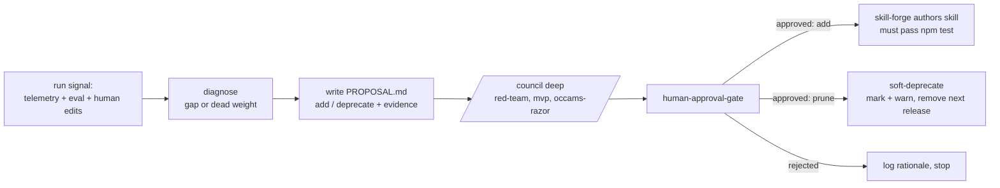

# DD: Issue #13 Skill Lifecycle (self-authoring / self-pruning workflows)

- status: draft
- owner: Autopraxis maintainer
- next gate: agent-fleet /council (deep) → human-approval-gate
- related: `backprop`, `run-telemetry`, `docs/reference/workflow-expansion.md`, `docs/reference/evaluation-framework.md`, global `skill-forge`/`agent-forge`

## Decision Need

- decision: Should Autopraxis gain an automated loop that learns from prior runs and **creates or retires workflow skills** — and if so, how much autonomy does it get?
- ask of reviewers: approve the **propose-only, human-gated** shape below, or reject/rescope.

## Context

Autopraxis's thesis is self-improvement, but skill inventory is curated by hand today. `docs/reference/workflow-expansion.md` is a manually authored, manually ranked candidate list (release-readiness, incident, security, ...). The request: automate producing that artifact, and let a scheduled or manual loop add skills it thinks are missing and prune ones it thinks are unused.

Cave man note: repo already has learning loop (`backprop`) and skill authoring (`skill-forge`). Missing piece is signal to learn from, plus a governed lifecycle that turns signal into skill add/retire proposals.

## Scope

- in scope: a `skill-lifecycle` meta-workflow that ingests run signal, diagnoses missing/dead workflows, and emits **proposals** (add / deprecate) gated by council + human.
- out of scope (this DD): any autonomous mutation of the package — no auto-create, no auto-delete, no auto-commit, no auto-publish, no unattended cron that writes skills.

## Blocking Precondition: No Signal Yet

`.workflow-runs/<run-id>/` is local and gitignored; the eval framework is `metric_status: contract_only` (model-free). **There is no accumulated run history to learn from.** A lifecycle loop run today would invent gaps from nothing and author noise — the exact bloat `mvp`/`occams-razor` councils exist to kill.

Therefore ordering is a hard gate:

1. **Signal first.** Extend `run-telemetry` to durably accumulate real run outcomes plus a human-edit/reject/rework field. Until this exists and has data, `skill-lifecycle` must refuse to author and only report "insufficient signal."
2. Then propose-only lifecycle (this DD).
3. Cron only after 2 proves it proposes good things by hand.

## Proposed Design

A meta-workflow that runs autonomously **up to the point of proposing** and hard-stops at every state-changing action.

- **Input:** `run-telemetry` history + eval results + failure/rework/human-edit signal.
- **Diagnose:** recurring unmet need (candidate new workflow) OR low-value skill (never invoked / low accepted-outcome rate). Reuses `backprop` diagnosis rather than re-inventing it.
- **Propose, never act:** emit `PROPOSAL.md` (add skill X / deprecate skill Y) with evidence pointers. This is the automated successor to hand-written `workflow-expansion.md`.
- **Gate:** `/council` deep (standing bloat controls `red-team`/`mvp`/`occams-razor` + task lenses) then `human-approval-gate`.
- **Author (add):** only after approval, via `skill-forge`; the new skill must carry the repo contract (frontmatter, README router row, eval fixture, telemetry, `## Self-Improvement`, Loop Controls) and pass `npm test`.
- **Prune:** **soft-deprecate only** — mark deprecated, warn on use, remove one release later. Never hard-delete on a whim.
- **Cron (optional, later):** may only open a proposal/PR and stop. It is a nag, not an actor. Human merges.

## Guardrails (non-negotiable)

- **No auto-prune of published skills.** Deleting capability from a published npm package others installed is a destructive one-way door. Human-approved soft-deprecation is the ceiling.
- **No cron that commits or publishes.** Autonomous writes to a supply-chain artifact are a trust/security boundary. Cron opens proposals/PRs only.
- **No skill bypasses review/eval/telemetry contracts.** Self-authored skills go through the same `npm test` gates as hand-authored ones.
- **Refuse on insufficient signal.** No authoring decisions from empty/thin telemetry.

Evidence these matter: this session alone hit a red `main` (incomplete rename), a lost release-bump commit, and a wrong-account push — all with a human in the loop. Remove the human and schedule it against a published package and those become unattended supply-chain failures.

## Alternatives Considered

| Option | Why rejected |
|---|---|
| Full autonomy: cron creates AND prunes skills it "doesn't need" (original ask) | Destructive, points unattended codegen at a published package, no signal to justify. Blocked as specified. |
| Fold entirely into `backprop`, no new skill | Backprop optimizes existing workflows; lifecycle add/retire of skills is a distinct governance surface. Reuse backprop diagnosis, but keep the gated add/retire flow separate. |
| Do nothing; keep `workflow-expansion.md` manual | Viable near-term, but doesn't scale and ignores the self-improvement thesis. Propose-only automation is the measured middle. |

## Test Plan

- `npm test` (frontmatter, router, eval fixture, telemetry) for any skill this loop authors.
- DD reviewed via `/council` deep; PROPOSAL flow validated on a synthetic signal fixture before real telemetry exists.
- Link validation for this DD.

## Open Questions

| Question | Blocks | Status |
|---|---|---|
| What exact human-edit/reject/rework fields must `run-telemetry` add for usable signal? | signal precondition | open |
| Minimum signal volume before authoring is allowed? | authoring gate | open |
| Does prune scope include shared primitives or only top-level workflows? | prune policy | open |
| Is cron even wanted, or is manual kickoff sufficient long-term? | scheduling | open |

## Recommendation

Approve **propose-only, human-gated `skill-lifecycle`**, sequenced strictly after a signal-capture upgrade to `run-telemetry`. Reject the fully-autonomous create/prune-on-cron version. Auto-prune of published skills: never; human-approved soft-deprecation is the ceiling.
