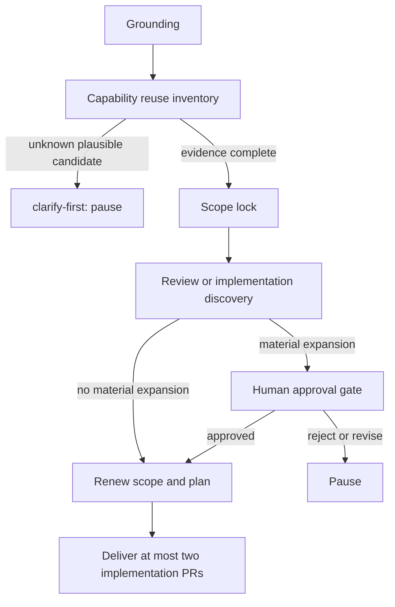

# DD: Issue #40 Capability Reuse And Scope Gates

- status: partial-ready; CI watcher delivery blocked
- owner: Autopraxis maintainer
- source: [GitHub issue #40](https://github.com/Zhachory1/autopraxis/issues/40)
- branch: `feat/capability-reuse-scope-gates`
- next gate: local Autopraxis implementation; human approval before CI watcher delivery or issue closure

## Context

Issue #40 closes two workflow failures:

- missing local code gets mistaken for missing capability;
- review discovery expands design, then implementation continues without renewed human approval.

Direct evidence:

- `skills/grounding-brief/SKILL.md` has a readiness gate, including `clarify-first`, but no reuse inventory.
- `skills/plan-to-launch/SKILL.md` has design kickback and final approval, but no stop-and-renew gate for material expansion.
- `skills/task-decomposition-planning/SKILL.md` has no delivery PR count cap.
- `skills/ci-watcher/SKILL.md` does not exist in this repository.
- `~/.mewrite/agent/skills/ci-watcher/SKILL.md` is a plausible existing capability, but its owner, source repository, packaging contract, and edit authority are unknown.

## Scope

Ready now:

- reuse inventory and unknown-access `clarify-first` contract in `grounding-brief`;
- material scope-expansion stop, human approval package, and renewed-approval state in `plan-to-launch`;
- two-implementation-PR cap in `task-decomposition-planning`;
- focused contract checks in `tests/validate-skills.mjs`;
- gate telemetry metrics in `run-telemetry`.

Blocked pending explicit human approval:

- downstream CI fan-out rule in owned CI watcher source; issue closure waits for this delivery.

Out of scope:

- new broker, proxy, service, datastore, queue, credential path, or platform abstraction;
- CI platform configuration or pipeline changes;
- telemetry schema/CLI changes;
- changes to vendored `agent-fleet` payload.

## Design

### Capability reuse inventory

Before proposing new infrastructure or platform abstraction, `grounding-brief` must list every plausible existing capability:

| Field | Required evidence |
|---|---|
| candidate and kind | repository/docs, MCP/tool catalog, SDK/client, or service catalog pointer |
| owner and consumers | known owner and current consumer pointers, or marked unknown |
| access and boundary | auth/access contract and deployment boundary, or marked unknown |
| result | `reuse`, `cannot-satisfy`, or `clarify-first` |
| inventory status | `complete`, `clarify-first`, or `no-candidate`; `no-candidate` only when no plausible candidate exists |
| rationale | evidence for result; lack of local implementation is never sufficient |

Search only supplied artifacts, available catalogs/tools, and one bounded repository search; record each source checked. Stop when remaining sources are unavailable or further search is low-yield. A plausible candidate with unknown access, ownership, deployment, or contract details returns `clarify-first`: blocker, owner, one requested fact, and resume condition. It blocks new-infrastructure planning.

### Scope-expansion gate

`plan-to-launch` records a scope fingerprint before shipping: intended files, effort band, systems, trust/deployment/rollback boundaries, and issue-wide implementation PR count. It pauses implementation and invokes `human-approval-gate` when discovery or review:

- adds infrastructure or trust boundary;
- doubles expected files, effort, or systems touched;
- raises delivery PR count above two;
- turns configuration/integration into new platform capability;
- changes deployment or rollback semantics.

Approval package must show fingerprinted original scope, discovery, smallest options, added cost/risk, recommendation, and existing `human-approval-gate` responses: approve, reject, revise, or extend budget. Approval resumes only when tied to fingerprint; reject ends paused run; revise returns to design and remains paused; extend budget approves recorded cap only. Any later delta repeats gate.

What matters:

- unknown is a stop signal, not proof of absence;
- discovery cannot silently amend an accepted implementation;
- PR splitting cannot evade scope review.

### Visible outputs and delivery cap

Use existing workflow outputs, not new framework:

- `grounding-brief` adds capability candidates, sources checked, decision, and `clarify-first` blocker/resume condition to `Source Inventory` and `Proceed Gate`.
- `plan-to-launch` adds fingerprint, approval state, and pause/resume action to `Gate State`.
- `task-decomposition-planning` adds issue-wide delivery PR count, approved cap, and deferred work to `Loop Policy` and `Open Blockers`.

`task-decomposition-planning` defaults to two implementation PRs across all repositories for issue. A third requires prior explicit human approval through scope-expansion package. Independent docs, telemetry entries, and validation commands do not consume cap.

### CI watcher boundary

No CI watcher implementation exists in this repository. Installed Me Write `ci-watcher` is candidate reuse, not owned source. Its required downstream fan-out behavior is:

- monitor parent required check and directly changed service;
- classify unrelated downstream failures once;
- stop serial monitoring of unrelated pipelines unless user explicitly asks.

Target repository/owner must be approved before editing it. Copying or reimplementing watcher here would violate issue #40's reuse rule.

## Telemetry

Use existing `run-telemetry` gate/escalation, human-response, and resume events with one run/scope fingerprint. Record candidate result/count, expansion reason, renewal state, and delivery PR count/cap; record CI fan-out result only in owned watcher source. Telemetry is evidence, not authoritative gate state. Its write failure is reported but never resumes a pending approval.

No new event schema or CLI parser is needed.

## Alternatives

| Option | Decision |
|---|---|
| Add local service-discovery or CI system | reject; new infrastructure and no need |
| Copy global CI watcher into Autopraxis | reject; duplicates plausible existing capability |
| Skip CI watcher acceptance | reject; leaves issue incomplete |
| Ask for CI watcher owner/source, then reuse it | selected |

## Risks And Gate

- risk: external CI watcher is edited without owner or deployment knowledge.
  mitigation: `clarify-first`; no external edit before explicit approval.
- risk: prompt checks prove wording, not execution behavior.
  mitigation: deterministic contract checks cover required gates; defer runtime evaluation until repository has an executable workflow harness.
- risk: one approval also authorizes future expansions.
  mitigation: approval applies only to recorded scope fingerprint; later material delta repeats gate.

## Human Approval Request

- decision: May this issue include a change to `~/.mewrite/agent/skills/ci-watcher/SKILL.md`, or provide its owned source repository and maintainer?
- owner: user/CI watcher maintainer.
- recommendation: provide owned source repository and maintainer; then make exact fan-out change there as second delivery PR.
- confidence: high that Autopraxis must not copy or modify unowned capability.
- approve: name source repo/path and approve scope.
- reject: ship three local Autopraxis gates only; issue CI watcher acceptance stays unresolved.
- revise: direct a different owned CI watcher capability.
- extend budget: approve more than two implementation PRs only for recorded scope fingerprint.
