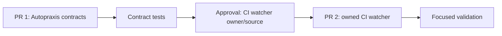

# Plan: Issue #40 Capability Reuse And Scope Gates

- status: partial-ready; watcher delivery and issue closure blocked
- source: `docs/issues/40-capability-reuse-scope-gates/DD.md`
- branch: `feat/capability-reuse-scope-gates`
- delivery cap: two implementation PRs across all issue repositories

## Scope Lock

Goal: make missing capability evidence explicit, stop material scope growth pending human approval, cap delivery at two implementation PRs, and stop unrelated CI fan-out.

Non-goals:

- no new service or platform abstraction;
- no CI configuration changes;
- no vendored `agent-fleet` changes;
- no third implementation PR without approval.

Success:

- inventory is required before infrastructure proposal;
- unknown plausible capability is `clarify-first`;
- material expansion pauses work for renewed approval;
- delivery plan cannot exceed two PRs without approval;
- approved CI watcher source stops unrelated fan-out;
- telemetry records inventory, expansion, and approval state.

Stop CI watcher task and issue closure if CI watcher owner/source remains unknown. Return to DD if a candidate requires new infrastructure. Ask human before a third implementation PR or new trust/deployment boundary.

Unknown external owner blocks only PR 2 and issue closure. PR 1 does not authorize PR 2. A third PR requires a new human approval package.

## Task Graph

### Task 0: Resolve CI watcher ownership

**Why**

Issue requires CI watcher behavior, but repository has no CI watcher source.

**Inputs**

- `docs/issues/40-capability-reuse-scope-gates/DD.md`
- `~/.mewrite/agent/skills/ci-watcher/SKILL.md`

**Output**

- explicit user approval and owned source repo/path, or rejection/defer decision.

**Acceptance**

- source owner and edit authority recorded;
- desired watcher release/install boundary known;
- no external file changed before approval.

**Validation**

- owner confirms target source and scope.

**Stop condition**

- no answer: Task 2 and issue closure remain paused; Task 1 may proceed.

### Task 1: Add local workflow contracts

**Depends on**

- none. This is owned local work; it must not claim CI watcher acceptance complete.

**Files**

- `skills/grounding-brief/SKILL.md`
- `skills/plan-to-launch/SKILL.md`
- `skills/task-decomposition-planning/SKILL.md`
- `skills/run-telemetry/SKILL.md`
- `tests/validate-skills.mjs`

**Steps**

- require bounded reuse inventory and `clarify-first` for unknown plausible candidates;
- define fingerprinted material-expansion triggers, approval package, pause/renew rules, and non-authoritative telemetry;
- cap issue-wide implementation delivery at two PRs and record deferred tasks;
- add deterministic contract checks for reuse, scope renewal, delivery cap, and telemetry fields.

**Acceptance**

- issue #40 local acceptance criteria map to visible skill outputs and tests;
- no new dependency, runtime component, or telemetry schema;
- one implementation PR; issue remains open until Task 2.

**Validation**

- `npm test`
- `npm pack --dry-run`

**Stop condition**

- planned scope exceeds one Autopraxis PR: return to approval gate.

### Task 2: Update owned CI watcher

**Depends on**

- Task 0
- Task 1

**Files**

- approved CI watcher source only.

**Steps**

- monitor parent required check and directly changed service;
- classify unrelated downstream failures once;
- end monitoring without serial unrelated pipeline fan-out unless requested;
- add focused regression check in owner repository when practical.

**Acceptance**

- unrelated downstream fan-out ends after first classification;
- directly changed service and parent required check stay monitored;
- no CI platform configuration changed.

**Validation**

- owner repository's focused skill/test validation.

**Stop condition**

- target differs from approved source or requires third delivery PR: return to approval gate.

## Execution Order

| Wave | Tasks | Gate |
|---|---|---|
| 1 | Task 1 | Autopraxis tests pass |
| 2 | Task 0 | explicit human source/owner approval |
| 3 | Task 2 | CI watcher owner validation passes; then close issue |

## Telemetry

- run ID: `issue-40-20260827`
- path: `.workflow-runs/issue-40-20260827/telemetry.jsonl`
- current gate: local delivery ready; CI watcher `clarify-first`
- required later events: scope-expansion gate, approval response, Task 1 validation, Task 2 validation, workflow end.
