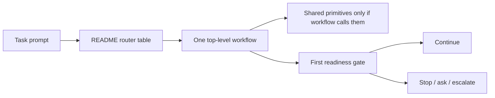

# DD: Issue #8 Workflow Router

## Decision Need

- decision: Implement issue #8 as documentation-first router plus validation.
- owner: Autopraxis maintainer.
- PRD: `docs/issues/8-workflow-router/PRD.md`
- next gate: council review.

## Context

Current repo has:

- README inventory for 7 top-level workflows and 9 shared skills.
- plugin installer and native manifests.
- open follow-up issues for evals, token budgets, council minimization, telemetry, and workflow research.

The router must improve first-run usability without adding workflow-engine complexity.

## Goals

- Put routing before inventory in README.
- Keep each route short and action-oriented.
- Separate user-facing workflows from shared connective skills.
- Add validation that prevents router guidance from disappearing.

## Non-Goals

- no new runtime command.
- no new skill directory.
- no mode enforcement logic.
- no changes to plugin manifests.
- no new eval harness.

## Proposed Design

### README start-here section

Add a section above `## Skills` with:

- compact advisory depth legend, clearly marked non-runtime until issue #10.
- role tags inside one task router.
- task router with 10+ examples.
- rule: shared skills are connective primitives usually called by workflows.

### Workflow guidance

Expand high-level workflow bullets to include:

- `Use when:` one sentence.
- `Do not use when:` one sentence.

Keep the inventory readable; avoid turning README into full docs.

### Validation

Extend `tests/validate-skills.mjs` to assert README includes:

- `## Start here` before `## Skills`.
- router table with at least 10 rows.
- every router row points to exactly one valid top-level workflow.
- no shared skill is recommended as a router entrypoint.
- shared skills are described as connective/internal primitives.
- all top-level workflows have `Use when:` and `Do not use when:` guidance.

## Router Visual

What to notice: the router is a single table, not a new engine or second workflow layer.

## Alternatives Considered

| Option | Pros | Cons | Decision |
|---|---|---|---|
| README router only | smallest, visible, no runtime risk | manual routing | selected |
| New `workflow-router` skill | agent-native routing | adds surface before evals | defer |
| CLI `which-skill` | executable UX | larger issue, overlaps #10/#12 | defer |
| Manifest-only metadata | machine-readable | not visible to humans | defer |

## Tradeoffs

- README gets longer, but first-run clarity improves.
- Advisory depth labels are not runtime modes until #10 implements budgets; this must be explicit.
- No router skill means agents may not auto-load routing; users still benefit from README and docs.

## Test Plan

- `npm test`
- markdown link validation via existing test.
- manual scan of README for readability.

## Rollout

This is docs + validation only. No migration required.

## Open Questions

- Should README link to `docs/roadmap/issue-roadmap.md`? No in the Start Here path; roadmap docs are maintainer artifacts.
- Should issue #8 PR close #8? Yes, if acceptance criteria are all met.
