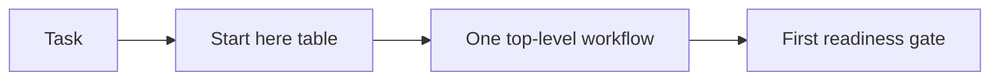

# PRD: Issue #8 Workflow Router

## Decision Need

- decision: Add the smallest useful routing layer so users choose the right Autopraxis workflow with low friction.
- owner: Autopraxis maintainer.
- linked issue: https://github.com/Zhachory1/autopraxis/issues/8
- next gate: DD and council review.

## Problem

Autopraxis exposes many workflows and shared skills, but no front door. Developers, PMs, leadership, and maintainers must infer which workflow to start with, which shared skills are internal primitives, and when a workflow is too heavy.

## Why This Matters

- customer/user impact: first-time users can install the plugin but still choose the wrong workflow or overuse heavy process.
- maintainer impact: future workflow expansion will increase confusion unless routing is explicit now.
- token/cost impact: wrong entrypoints can load extra skills, councils, templates, and handoffs.
- evidence: open issue #8, council roadmap, current README skill inventory.

## Goals

- Add a `Start here` section above the skill inventory.
- Route common tasks to one entry workflow plus an advisory depth label.
- Show role paths for developers, PM/product, leadership, and maintainers.
- Add `use when` / `do not use when` guidance for every top-level workflow.
- Mark shared skills as connective/internal by default.
- Keep the patch small enough to ship before deeper mode/eval work.

## Non-Goals

- Build a full router engine.
- Add a new top-level `workflow-router` skill in this PR.
- Implement enforceable lite/default/deep semantics; issue #10 owns real mode budgets and escalation behavior.
- Change existing skill behavior.
- Solve evals, telemetry tooling, or council minimization.

## Primary Metric

- user can choose the correct starting workflow for at least 10 common task prompts from README guidance alone.

## Guardrails

- do not add another large skill unless necessary.
- do not require reading all shared skills to start.
- do not make `deep` the default path for low-risk work.
- no broken markdown links.

## User Paths

The router should be one table with role as context, not separate competing choosers. Each row chooses one top-level workflow. Shared skills, including `human-approval-gate`, are outputs/primitives inside workflows rather than entrypoints.

What to notice: the router chooses a single workflow first, then lets that workflow call shared primitives only when needed.

## Acceptance Criteria

- README contains `Start here` before the skill inventory.
- Router table covers at least 10 common tasks.
- Each route recommends exactly one top-level workflow and may include an advisory depth label.
- Workflow inventory includes `use when` / `do not use when` for all 7 top-level workflows.
- Shared skills are labeled connective primitives.
- Validation checks the router section and guidance tokens.

## Open Questions

- Should advisory depth labels appear before issue #10 implements exact budgets? Answer for this PR: yes, but they are explicitly non-runtime guidance and not token-budget semantics.
- Should there be a `workflow-router` skill? Answer for this PR: no; defer until usage/eval proves README routing is insufficient.
