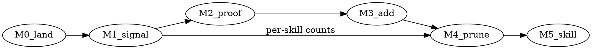

# Roadmap: Self-Improving Skill Lifecycle

- horizon: now / next / later
- status: draft
- owner: Autopraxis maintainer
- source: issue #13 DD + council synthesis (`docs/issues/13-skill-lifecycle/DD.md`)
- approval gate: agent-fleet /council (per milestone) → human-approval-gate

## Why This Roadmap Exists

- strategic goal: Autopraxis learns from its own runs and, on manual kickoff, proposes **adding** missing workflow skills and **retiring** dead ones — the full self-authoring / self-pruning loop.
- success definition: a maintainer runs one command, gets evidence-backed add/deprecate proposals whose acceptance rate beats the hand-written `workflow-expansion.md` it replaces.
- constraints: propose-only, human-gated, no cron; never auto-delete a published skill; never corrupt the npm package.

## Narrative

The goal is unchanged. Council did not reject it — it rejected **building the workflow before the signal it learns from exists or is trustworthy**. The whole thing is bottlenecked on one thing: usable run signal. So the roadmap front-loads signal (and fixes the semantic bugs council found), proves the loop by hand, then automates ADD, then — last and most carefully — prune. Each step is independently useful and independently revertible.

## Themes

| Theme | Outcome | Gate |
|---|---|---|
| Signal | trustworthy, aggregatable run telemetry | schema + eval fixture |
| Manual proof | maintainer reproduces the loop by hand from real data | ≥5 real runs |
| Automated ADD | backprop proposes missing skills | council + human |
| Governed PRUNE | soft-deprecate dead skills by ownership seam | council + human |

## Now

### M0 — Land the pending work (unblock the tree)

- what: merge open PRs #29 (model-tiers) and revise/split #30 (this DD → telemetry-only scope).
- why now: #30 as written should not merge (council REVISE). Reshape it to the signal-only slice below before it lands.
- exit: `main` green; DD reflects council; model-tiers merged.

### M1 — Signal upgrade to `run-telemetry` (the one true bottleneck)

- what: add three fields under `metrics`, but with the semantics council demanded:
  - `skills_invoked` / `agents_invoked` — **auto-emitted by the loader**, not agent memory. Absence must mean "not loaded," not "agent forgot."
  - `run_disposition` (`accepted|edited|rejected`) — as a **late event keyed by `run_id`** (new `human_response`/audit emit), never on the run's own `end`. Add a "pending" watermark.
  - `unmet_need` (bool + short note) — defined as a **concrete router state** (default/unmatched route id), not "user improvised."
- also: define **one aggregate store** (committed or exported append-only JSONL, dedup by `run_id`) so learning spans checkouts/machines — `.workflow-runs/` alone is siloed.
- add the fields to `telemetry-event-v1.schema.json` (stays v1, `metrics` is `additionalProperties:true`) + one eval fixture; keep `unmet_need_note` in the privacy allowlist.
- why now: everything downstream is fiction without this, and these are the exact BLOCKERs council raised.
- exit: fields emit automatically, disposition backfills via late event, aggregate store defined, fixture green.

## Next

### M2 — Accumulate + manual proof (≥5 real runs)

- what: dogfood existing workflows; let signal accrue in the aggregate store. Then a maintainer answers **by hand**, with a `autopraxis telemetry` query: "what's never invoked?" and "where did the router return unmatched?"
- why next: proves the signal is real and the diagnosis is possible before any skill is written. If the hand query is not yet repetitive/valuable, stop here — no automation earned.
- exit: ≥5 runs in the store; maintainer produces one real candidate (add or dead) from data, not intuition.

### M3 — Automated ADD via `backprop` (not a new meta-workflow)

- what: extend `backprop` with a "missing-skill / dead-skill" hypothesis type. It already does ingest→diagnose→propose→/council→human-approval→handoff; ADD is that flow with an evidence-backed proposal. Author approved skills via `skill-forge`; must pass `npm test` (frontmatter, router row, eval fixture, telemetry, Self-Improvement, Loop Controls).
- why here: council showed the ADD path is 100% backprop + skill-forge already. Fold, don't duplicate.
- exit: one real missing-workflow proposal generated from M2 signal, council-reviewed, human-approved, shipped as a skill — replacing a `workflow-expansion.md` entry.

## Later

### M4 — Governed PRUNE (soft-deprecate, ownership-split)

- what: the genuinely-new verb. Propose deprecation of dead skills, split by ownership seam:
  - repo-owned skill/workflow → in-repo soft-deprecate (mark → warn-on-use → remove next release).
  - vendored/persona agent (upstream-owned) → proposal is an **upstream issue/PR against agent-fleet only**; never a local mark (re-vendor via `bin/sync-agent-fleet.mjs` would clobber it).
- guards: exclude safety/incident/security/rare skills from absence-based prune; gate on **per-skill invocation counts**, not a global 5-run window; add a proposal-precision metric with auto-revert to report-only if precision drops.
- why last: destructive axis, weakest signal, most false-positive risk. Earn it after ADD works.
- exit: one dead repo-owned skill soft-deprecated end-to-end via council + human; vendored-agent path proven as upstream PR.

### M5 — Lifecycle skill (only if M3+M4 prove repetitive)

- what: iff the backprop ADD path + PRUNE governance are run often enough to justify a dedicated front door, wrap them in a thin `skill-lifecycle` skill that **consumes** backprop's diagnosis (one reader of the signal) rather than re-reading raw telemetry.
- why maybe-never: if backprop modes suffice, this skill is unnecessary surface. Decide with usage data.
- exit: evidence the wrapper reduces friction; otherwise skip.

## Dependencies

Critical path is M1. M2 is a waiting/accrual gate, not build effort. M3 and M4 are independent once signal exists; M4 must not precede M3 (prune before add = erode before build). M5 is optional.

## Guardrails (carried from council)

- signal semantics fixed before any consumer: late disposition, loader-emitted invocation, defined aggregate store.
- add-only until M4; prune never touches vendored assets locally.
- every add/retire routes through /council + human-approval; no cron.
- kill criterion: if proposal precision underperforms the hand-written baseline, revert to report-only.

## Review Cadence

- re-plan trigger: M2 signal proves unusable, or M3 proposal precision underperforms `workflow-expansion.md`.
- each milestone ships as its own risk-sized PR with DD when it changes runtime behavior.
