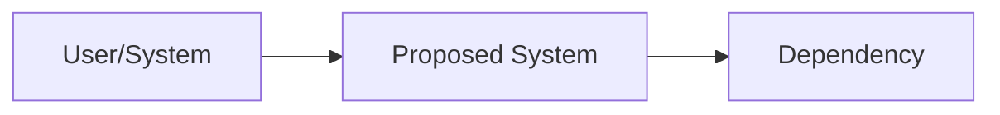
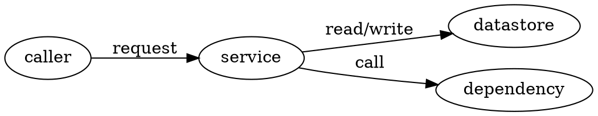
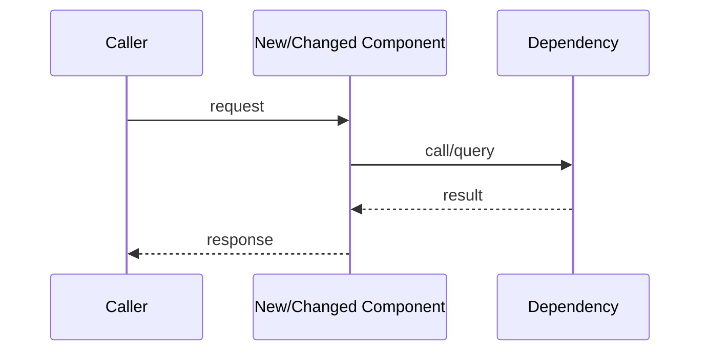

# Design Doc / RFC Template

Use this template after PRD/problem alignment when the technical approach needs feedback before implementation. Write enough to expose architecture, tradeoffs, and cross-cutting concerns while the work is still cheap to change.

## Header

```markdown
# DD: <Design Name>

- status: draft | in-review | approved | superseded
- responsible owner:
- reviewers:
- PRD/problem link:
- related ADRs:
- target implementation window:
- next gate: agent-fleet /council | task-decomposition-planning | human-approval-gate
```

## Context And Scope

```markdown
## Context

Summarize objective facts: existing system, constraints, user/product requirements, relevant incidents, prior decisions, and code/data paths.

## Scope

- in scope:
- out of scope:
- assumptions:
- dependencies:

## Goals

- goal:
  success criterion:

## Non-Goals

- non-goal:
  why excluded:
```

## Proposed Design

~~~markdown
## Overview

Describe the high-level implementation strategy and why it satisfies the goals.

## System Context

Include diagrams liberally so humans and agents can see the system. Use Mermaid for flow/sequence/state diagrams and Graphviz/DOT for dense dependency graphs.





After each diagram, explain what changed, what boundary matters, and what risk it clarifies.

## Data Flow Or Control Flow



## Components And Responsibilities

| Component | Responsibility | Owner | Notes |
|---|---|---|---|
| <component> | <responsibility> | <owner> | <notes> |

## Interfaces And Contracts

- API/CLI/event/schema:
  contract:
  compatibility:
  failure modes:
~~~

## Alternatives And Tradeoffs

```markdown
## Alternatives Considered

| Option | Pros | Cons | Cost/Risk | Why Selected/Rejected |
|---|---|---|---|---|
| <option> | <pros> | <cons> | <cost/risk> | <reason> |

## Key Tradeoffs

- tradeoff:
  decision:
  consequence:
  mitigation:
```

## Cross-Cutting Concerns

```markdown
## Security And Privacy

- data handled:
- authn/authz impact:
- secrets handling:
- privacy review needed:
- threat/failure scenario:

## Reliability And Operations

- SLO/SLI impact:
- alerts/monitors:
- dashboards:
- rollback:
- degradation/fallback:

## Performance And Cost

- latency/throughput impact:
- capacity assumptions:
- cost drivers:
- scaling limits:

## Data And Migration

- schema changes:
- backfill/migration plan:
- idempotency:
- data quality checks:
- rollback constraints:

## Testing And Validation

- unit tests:
- integration tests:
- e2e/manual checks:
- observability validation:
- acceptance criteria:
```

## Rollout Plan

```markdown
## Rollout

- phase:
  audience/scope:
  entry criteria:
  exit criteria:
  owner:

## Rollback

- trigger:
- steps:
- owner:
- data recovery notes:
```

## Decision Frame

Use SPADE for high-stakes design choices.

```markdown
## SPADE

- setting:
- people:
- alternatives:
- decision:
- explanation plan:
```

## Review And Open Questions

```markdown
## Open Questions

| Question | Owner | Blocks | Due | Status |
|---|---|---|---|---|
| <question> | <owner> | implementation/launch | <date> | open |

## Review Checklist

- goals/non-goals clear.
- design is understandable from diagrams plus prose.
- alternatives and tradeoffs included.
- cross-cutting concerns addressed or explicitly not applicable.
- rollout and rollback are realistic.
- implementation can be decomposed into tasks.
```
