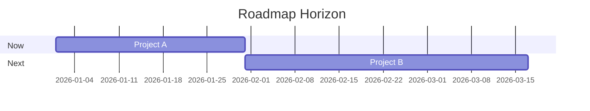
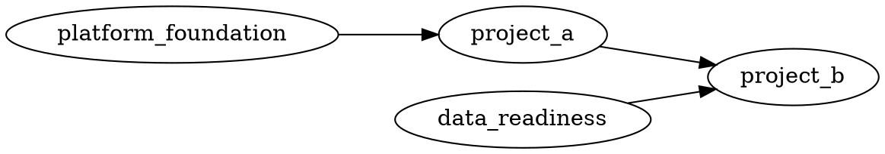

# Roadmap Template

Use this template to sequence work across a horizon. A roadmap is not a backlog dump; it is a strategic tradeoff artifact that explains why work is grouped, ordered, and resourced.

## Header

```markdown
# Roadmap: <Area / Horizon>

- horizon: now/next/later | quarter | half | year
- status: draft | in-review | approved | superseded
- owner:
- stakeholders:
- source strategy/OKRs:
- approval gate:
```

## Strategic Goal

```markdown
## Why This Roadmap Exists

- strategic goal:
- target users/customers:
- business outcome:
- success definition:
- constraints:

## Narrative

Explain the roadmap in everyday language. Start with why before listing work.
```

## Themes And Outcomes

```markdown
## Themes / Epics

| Theme | Outcome | Metric | Why Now | Owner |
|---|---|---|---|---|
| <theme> | <outcome> | <metric> | <reason> | <owner> |
```

## Candidate Evaluation

```markdown
## Candidate Scores

| Project | Value | Cost/Effort | Risk | Confidence | Strategic Fit | Score | Rationale |
|---|---:|---:|---:|---:|---:|---:|---|
| <project> | 1-5 | 1-5 | 1-5 | 1-5 | 1-5 | <score> | <why> |

## Scoring Notes

- value definition:
- cost definition:
- risk definition:
- confidence definition:
- tie-breaker:
```

## Visual Roadmap

Use Mermaid for horizons/time and Graphviz/DOT for dependencies across projects, teams, and prerequisites.





Explain sequencing tradeoffs, critical path, capacity conflicts, and why work is now/next/later.

## Sequencing

```markdown
## Now / Next / Later

### Now

- project:
  why now:
  owner:
  dependencies:
  success criteria:

### Next

- project:
  why next:
  owner:
  dependencies:
  success criteria:

### Later

- project:
  why later:
  owner:
  dependencies:
  success criteria:
```

## Capacity And Dependencies

```markdown
## Dependency Map

| Dependency | Blocks | Owner | Needed By | Status | Risk |
|---|---|---|---|---|---|
| <dependency> | <project> | <owner> | <date> | open | <risk> |

## Capacity Allocation

| Team/Person | Capacity | Assigned Work | Skill Fit | Risk/Conflict |
|---|---:|---|---|---|
| <team> | <capacity> | <work> | <fit> | <risk> |
```

## Milestones And Review Cadence

```markdown
## Milestones

| Date | Milestone | Exit Criteria | Owner |
|---|---|---|---|
| <date> | <milestone> | <criteria> | <owner> |

## Review Cadence

- roadmap review date:
- metrics review:
- dependency review:
- re-planning trigger:
```

## Stakeholder Presentation

```markdown
## Approval Narrative

- recommendation:
- evidence summary:
- tradeoffs accepted:
- risks:
- asks:

## Keep Handy

Keep detailed research and scoring evidence linked, not dumped into the presentation.
```

## Roadmap Checklist

```markdown
## Checklist

- starts with strategic goal and success definition.
- themes/epics connect to outcomes.
- sequence shows explicit tradeoffs.
- dependencies and capacity are realistic.
- roadmap is visualizable and concise.
- stakeholders know what decision is being asked.
- roadmap can change when facts change.
```
