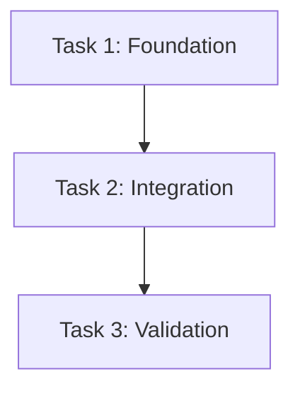
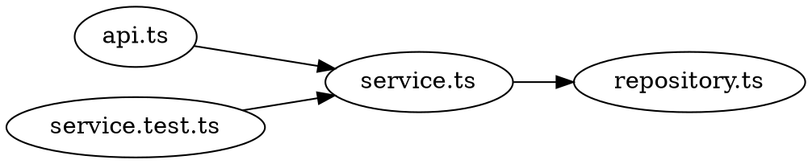

# Technical Plan / Task List Template

Use this template after PRD and DD approval. The plan should let an implementer execute without rediscovering intent, files, interfaces, dependencies, or tests.

## Header

```markdown
# Technical Plan: <Feature Or Change>

- status: draft | ready-for-implementation | in-progress | complete | superseded
- source PRD:
- source DD/RFC:
- responsible owner:
- implementers:
- reviewers:
- target branch/repo:
- execution mode: subagent-driven | inline | human-led
```

## Scope Lock

```markdown
## Accepted Scope

- goal:
- non-goals:
- success criteria:
- validation required:
- rollout/rollback required:

## Stop Conditions

- stop and ask if:
- return to DD if:
- escalate to human if:
```

## File And Responsibility Map

```markdown
## File Structure

| Path | Create/Modify | Responsibility | Depends On | Notes |
|---|---|---|---|---|
| <path> | create/modify | <single responsibility> | <dependency> | <notes> |

## Interface Contracts

- name:
  defined in:
  consumed by:
  signature/schema:
  compatibility notes:
```

## Visual Execution Map

Use Mermaid for task ordering and Graphviz/DOT for file/module dependencies.





Explain which tasks can run in parallel, which are blockers, and which interfaces downstream tasks rely on.

## Task Graph

```markdown
## Tasks

### Task <N>: <Task Name>

**Why**

Explain where this task fits in the accepted design.

**Inputs**

- source files/docs:
- dependencies from earlier tasks:
- assumptions:

**Outputs**

- files changed:
- functions/types/contracts produced:
- downstream tasks that consume this:

**Steps**

- <specific implementation step>
- <specific test/doc step>

**Acceptance Criteria**

- criterion:
  evidence:

**Validation**

- command/check:
  expected result:

**Rollback Or Recovery**

- rollback notes:

**Do Not**

- scope exclusions for this task:
```

## Execution Waves

```markdown
## Execution Order

| Wave | Tasks | Gate Before Next Wave | Owner |
|---|---|---|---|
| 1 | <tasks> | <tests/review> | <owner> |

## Review Checkpoints

- after task/wave:
  reviewer:
  review scope:
  must pass before:
```

## Testing Strategy

```markdown
## Test Plan

- unit:
- integration:
- e2e/manual:
- migration/backfill validation:
- observability validation:
- regression cases:

## Validation Commands

| Command | Purpose | Expected |
|---|---|---|
| `<command>` | <purpose> | pass |
```

## Implementation Handoff

```markdown
## Handoff To Implementer

- read first:
- execute tasks in order:
- ask before changing:
- report format:
  - status: done | done-with-concerns | blocked | needs-context
  - changed files:
  - validation:
  - concerns:

## No Placeholders Rule

Do not write “same as above”, “similar pattern”, or unspecified TODOs. Repeat exact names, signatures, paths, and expected tests where needed.
```

## Plan Review Checklist

```markdown
## Plan Self-Review

- every task has a test/validation loop.
- every task is small enough to review independently.
- file responsibilities are clear and not overloaded.
- names/signatures used by later tasks match earlier outputs.
- plan does not add scope beyond PRD/DD.
- blocked assumptions are explicit.
```
